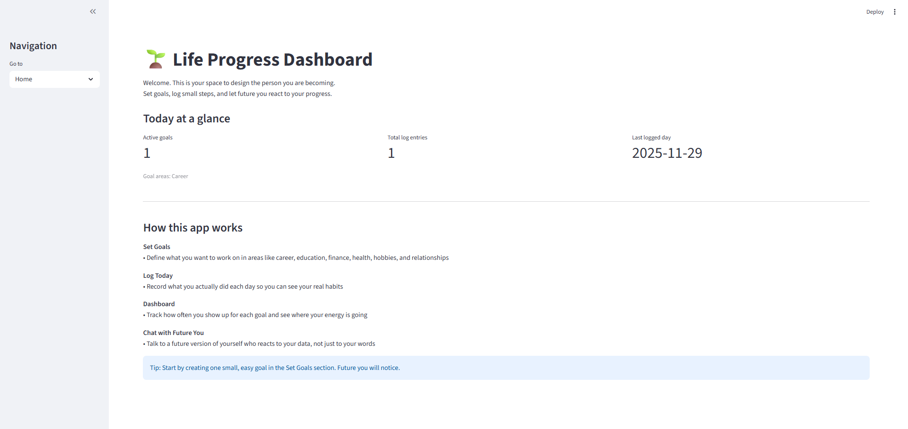
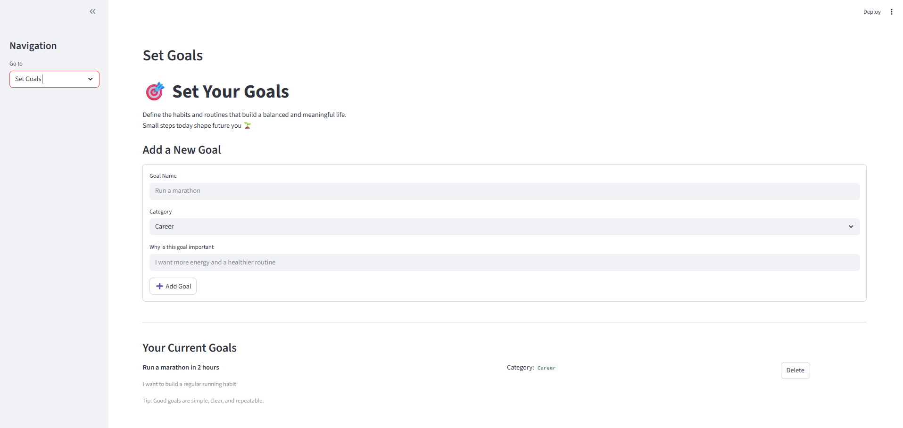
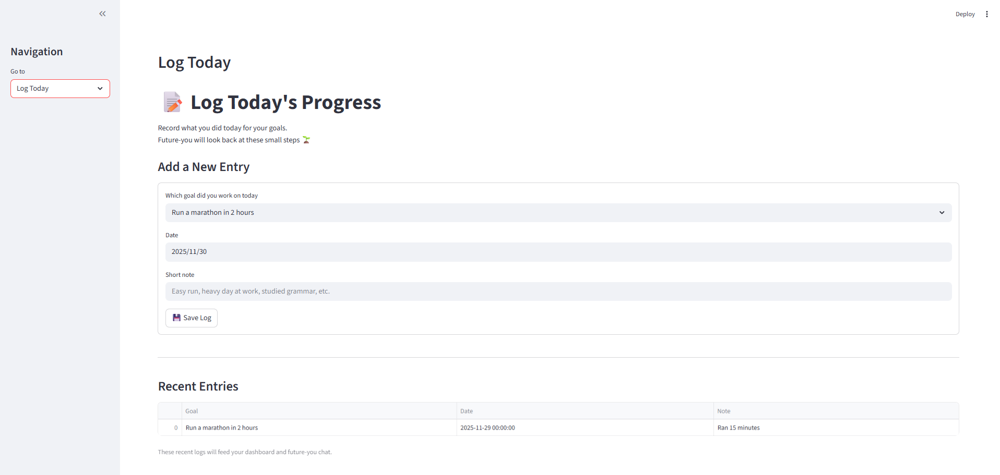
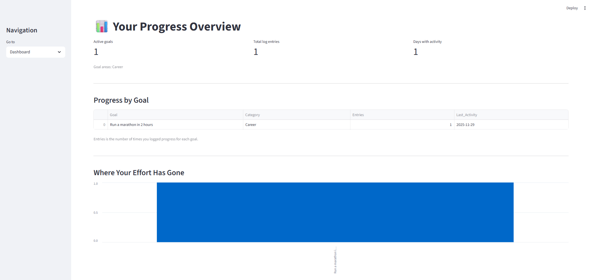
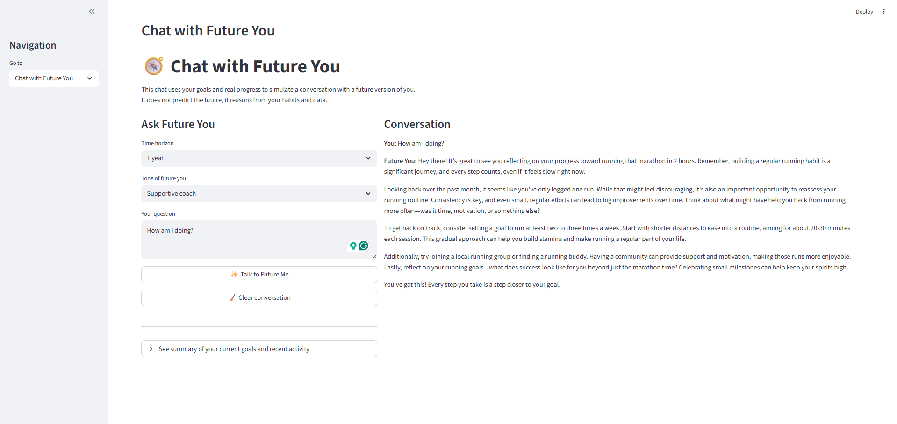

# 🌱 Life Progress Dashboard + Future You Chatbot  
*A Streamlit app that lets you set goals, track habits, and talk to a future version of yourself.*

🔗 **Live App:** [https://life-progress-dashboard.streamlit.app/](https://playitpat-life-progress-future-you-chat-app-kolxaf.streamlit.app/)




---

## ✨ Overview

This project combines **habit tracking**, **qualitative reflection**, and **LLM-powered coaching**.  
Users define goals, log daily actions, and the app uses **OpenAI GPT-4o-mini** to generate reflective guidance from their “future self.”

Technologies used:

- Python  
- Streamlit  
- Pandas  
- OpenAI API  
- Lightweight JSON persistence  
- Interactive visualizations  

This project demonstrates full-stack capability: UX design, state management, prompting, data persistence, and deployment-ready structure.

---

## 🚀 Features

### 🎯 Set Goals  

Define meaningful goals across six life areas:
- Career  
- Education  
- Finance  
- Health  
- Hobbies  
- Relationships  

Each goal includes a short explanation of why it matters.

---

### 📝 Log Today  

Capture qualitative daily progress such as:
- “Easy run after work”  
- “Studied Japanese grammar”  
- “Updated GitHub repo”  

No numbers. No pressure. Just consistency.

---

### 📊 Dashboard  

View insights like:
- How often you show up per goal  
- When you last worked on each goal  
- Total days with activity  
- A clean bar chart showing effort distribution  

---

### 🧭 Chat with Future You  

A coaching-style AI persona that:
- Reads your goals  
- Analyzes your recent logs  
- Reacts with a chosen tone (coach, tough love, best friend, stoic mentor)  
- Speaks as your “Future Self” 6 months to 5 years ahead  

This is powered by a structured prompt system that includes your real activity and life goals.

---

## ▶️ Getting Started

### 1. Install dependencies

```bash
pip install -r requirements.txt
```

### 2. Add your API key
Create a .env file in the project root and add:

```bash
OPENAI_API_KEY="your_api_key_here"
```

### 3. Run the app
```bash
streamlit run app.py
```

---

## 🎯 Why This Project Matters

This project demonstrates practical, job-relevant skills across engineering, analytics, and product thinking. It goes beyond a simple demo and shows you can design, build, and ship a complete application.

### **Engineering Skills**
- Building a multi-page Streamlit application  
- Managing state across pages  
- Implementing JSON-based persistence  
- Integrating the OpenAI API with structured prompts  
- Designing a clean UI with clear user flows  

### **Analytics Skills**
- Transforming qualitative logs into usable insights  
- Creating intuitive dashboards with Pandas and Streamlit  
- Visualizing behavior patterns and habit frequency  
- Turning raw user data into interpretable metrics  

### **Product / UX Skills**
- Designing a user-centric habit tracker  
- Balancing qualitative inputs with meaningful analytics  
- Creating a “Future You” conversational agent  
- Building an experience that blends reflection, motivation, and data  
